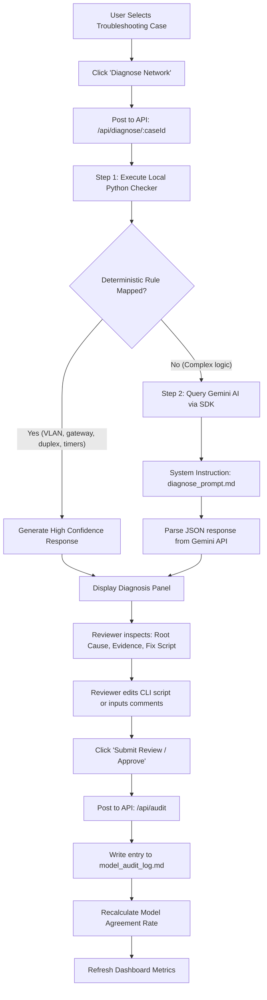
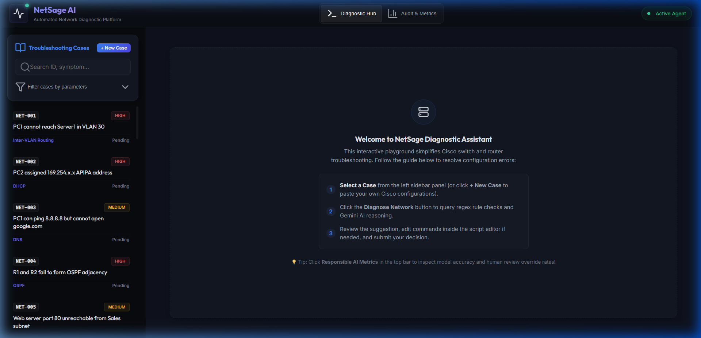
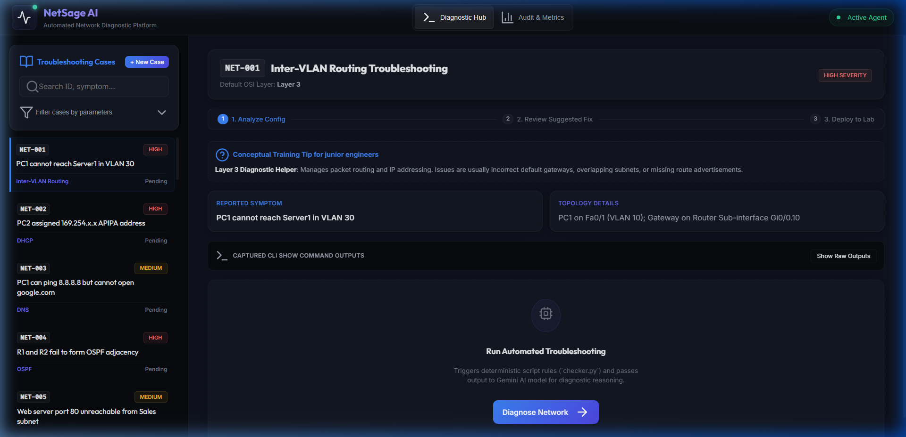
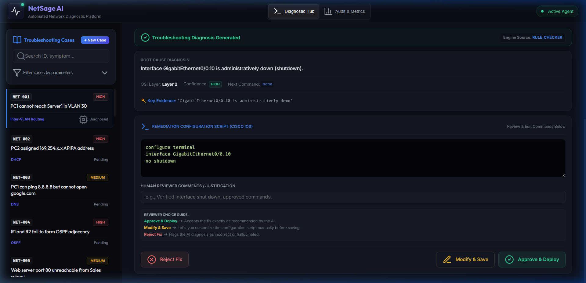
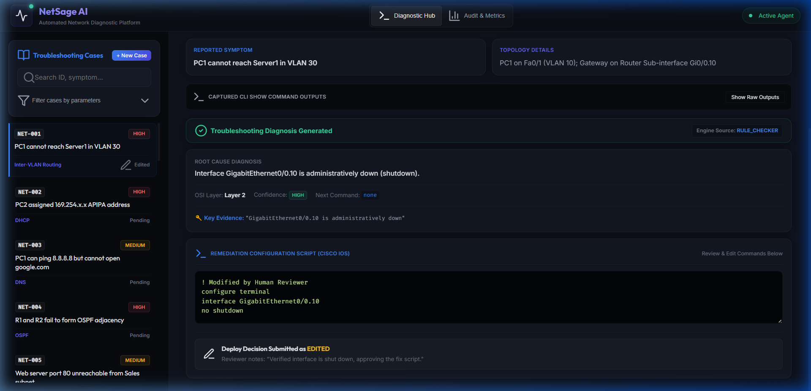
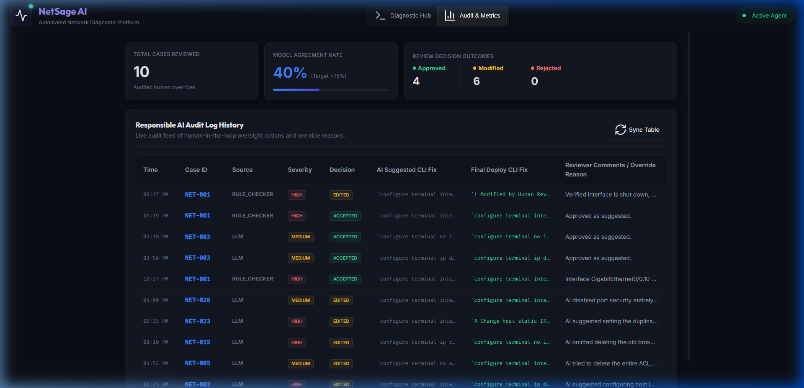

# NetSage AI - Project Summary & Execution Report

NetSage AI is an AI-assisted network troubleshooting platform designed for Cisco-style lab environments (such as Packet Tracer). It features a hybrid diagnostic engine combining deterministic local analysis with generative AI, managed by a human-in-the-loop review pipeline.

This report serves as the final documentation summarizing the system architecture, dataset, prompting strategy, deterministic checks, safety guidelines, and live metrics dashboard interface.

---

## 1. Executive Summary & Core Objectives

In network engineering education, troubleshooting represents a key threshold of competence. Junior network engineers often understand isolated configuration commands but struggle with diagnostics: tracing symptoms to root causes across the different layers of the OSI model.

NetSage AI bridges this gap by acting as a copilot that:
*   **Decouples Symptoms from Causes**: Automatically parses Cisco show-command outputs to extract evidence.
*   **Applies Hybrid Diagnostics**: Runs local deterministic regex rule matching to catch common config traps instantly, falling back to LLM diagnostics for multi-variable logic.
*   **Enforces Safety via Human-in-the-Loop (HITL)**: Prompts junior engineers to act as final reviewers. Every AI-suggested command script must be reviewed, edited if necessary, and approved before being logged and deployed.
*   **Maintains Accountability**: Audits accuracy metrics and records every correction to build an override feed for instructors.

---

## 2. System Architecture & Diagnostic Workflow

NetSage AI utilizes a modern full-stack web architecture:



### Components Overview
1.  **Frontend Dashboard (React + Vite + CSS)**: A dark-themed dashboard presenting the 30 active network cases. Includes advanced filters for OSI layers, severities, and status (diagnosed, reviewed, edited). Displays an interactive terminal editor for checking, modifying, and approving CLI remediation scripts.
2.  **API Server (Node.js + Express)**: Serves static cases parsed from `cases.csv`, acts as the coordinate for local rules and Gemini, and manages read/write actions for the audit logs and metrics.
3.  **Deterministic Rule Checker (`checker.py`)**: A Python 3 script spawned as a subprocess. It uses regular expressions to parse Cisco outputs for 15 deterministic configuration mistakes.
4.  **Generative AI Diagnostic Engine (`engine.js`)**: Leverages the Gemini API (`gemini-2.5-flash`) structured with a system prompt and JSON schema. If the rule checker passes without errors, the LLM parses the command output to identify subtle logical anomalies.

---

## 3. Case Database Analysis (`cases.csv`)

NetSage AI is preloaded with **30 structured network cases** (located in [cases.csv](file:///c:/Users/Admin/work/NetSage/resources/cases.csv)). These cases represent realistic Packet Tracer lab errors distributed across multiple concepts, OSI layers, and severity levels.

### Case Distribution by OSI Layer

| OSI Layer | Troubleshooting Scope | Number of Cases | Key Concepts Covered |
| :--- | :--- | :--- | :--- |
| **Layer 2** | Local frame switching, switching states, physical interfaces | 8 cases | VLAN access ports, Trunking allowed lists, VTP domain casing, Port Security violations, CDP config |
| **Layer 3** | Packet routing, addressing, logic | 15 cases | Inter-VLAN routing (Sub-interfaces), OSPF adjacency/redistribution, static routing next-hop, NAT direction, HSRP timers, IPv6 ND suppression, duplicate IP conflicts |
| **Layer 4** | Connection boundaries, ports | 4 cases | Extended ACL blocking HTTP (port 80), SSL/TLS (port 443), and FTP ports (control 21 / data 20) |
| **Layer 7** | Application layer services | 3 cases | DHCP IP exhaustion, DNS domain-lookup services, DHCP relay helpers |

### Summary of Case Database Fields
*   `case_id`: Unique identifier (`NET-001` to `NET-030`).
*   `symptom`: High-level network problem description reported by the client/user.
*   `topology_note`: Descriptions of interfaces, VLAN configurations, and subnet segments.
*   `show_outputs`: Realistic CLI command snippets (e.g., `show running-config`, `show ip ospf interface`, `show access-lists`, `show ip dhcp binding`).
*   `expected_fault`: The baseline network issue causing the symptom.
*   `osi_layer`: The target layer of the network stack.
*   `concept_tag`: High-level category tag (DHCP, OSPF, Switching, ACL, etc.).
*   `severity`: Criticality classification (`High`, `Medium`, `Low`).

---

## 4. Deterministic Rule Checker (`checker.py`)

The local rule checker executes regex validations. If a case matches any rule, the system returns a `high` confidence diagnosis instantly without querying the LLM, reducing latency and API usage.

The engine detects the following **15 deterministic configurations**:

```python
# Regex rules defined in checker.py:
1. INTERFACE_ADMIN_DOWN        # Checks for 'is administratively down' on sub-interfaces
2. DHCP_POOL_EXHAUSTED         # Checks for pool exhaustion ('zero available' leases in DHCP pool)
3. MISSING_DHCP_HELPER         # Checks for DHCP relay interface missing 'ip helper-address'
4. NAT_OVERLOAD_MISSING        # Checks for dynamic NAT missing 'overload' (no PAT support)
5. NAT_INTERFACE_DIR_MISSING   # Checks inside interface configuration missing 'ip nat inside'
6. VLAN_PRUNED_FROM_TRUNK      # Checks for VLANs missing from 'switchport trunk allowed vlan'
7. TRUNK_CONFIGURED_AS_ACCESS  # Checks if switch inter-connection is 'switchport mode access'
8. OSPF_HELLO_INTERVAL_MISMATCH# Checks for timer mismatch in neighbor interface configs
9. OSPF_PASSIVE_INTERFACE_ERROR# Checks if OSPF interface is active but marked as 'passive-interface'
10. WRONG_ACCESS_VLAN          # Checks for switch access port assigned to non-existent or wrong VLAN
11. DUPLICATE_IP_ADDRESS       # Checks for conflicting IP syslog flags (%IP-4-DUP_ADDR)
12. GATEWAY_OUTSIDE_SUBNET     # Checks if host gateway address is outside subnet block boundaries
13. MISSING_DOT1Q_ENCAP        # Checks router sub-interface missing 'encapsulation dot1Q'
14. NATIVE_VLAN_MISMATCH       # Checks native VLAN configuration discrepancy across trunk link
15. GATEWAY_IP_MISCONFIGURED   # Checks if host default gateway points to an invalid address
```

---

## 5. Generative AI Prompting Strategy

The system prompt template (located in [diagnose_prompt.md](file:///c:/Users/Admin/work/NetSage/prompts/diagnose_prompt.md)) enforces structured responses.

### Structured Response Schema
The system requires Gemini to respond in a strict JSON format matching this schema:
```json
{
  "root_cause": "Detailed diagnostic explanation.",
  "osi_layer": "Layer 2 | Layer 3 | Layer 4 | Layer 7",
  "confidence": "high | medium | low",
  "evidence": "Exact string segment matched in the CLI command outputs.",
  "next_command": "CLI show-command to run next if confidence is medium or low. Otherwise, 'none'.",
  "fix_steps": "Newline-separated Cisco IOS config commands."
}
```

### Few-Shot Learning Inclusion
To establish output compliance, the prompt includes worked examples demonstrating:
1.  **High-Confidence Resolution**: Explains an administratively shutdown sub-interface.
2.  **Medium-Confidence Resolution**: Explains an OSPF adjacency issue where hello-interval mismatches require secondary verification commands on the neighbor device.

---

## 6. Human-in-the-Loop & Audit Log Verification

The core safety rule of NetSage AI is **mandatory human oversight**. No AI diagnosis or remediation script is accepted as-is; it must be approved or edited by a human reviewer.

### Model Audit Log (`model_audit_log.md`)
The audit log (located in [model_audit_log.md](file:///c:/Users/Admin/work/NetSage/docs/model_audit_log.md)) maintains the record of reviewed cases. Each time a human reviews a case:
*   The entry is appended with timestamps, Case ID, source, severity, decision status (`accepted` or `edited`), original fix script, modified final script, and reviewer override comments.
*   The backend recalculates the **Model Agreement Rate** (percentage of reviews accepted without script modification) and updates the header metrics.

> [!NOTE]
> NetSage AI comes with 5 baseline historical audit corrections demonstrating cases where the AI made a mistake (e.g. suggesting deleting access-lists rather than removing access-groups, disabling port-security entirely instead of running shutdown/no shutdown, or configuring duplicate static IP addresses).

---

## 7. Visual Interface Walkthrough

Below is a step-by-step walkthrough of the user interface capturing the core operations of the application:

### A. Dashboard Hub
The main screen lists the 30 troubleshooting cases with a searchable filter bar to query cases by search string, OSI layer, severity, and review status.



### B. Selecting a Network Case
Selecting a case (e.g., `NET-001`) reveals its metadata, symptoms, topology notes, and the raw Cisco CLI show-command output.



### C. Running Diagnosis
Clicking **Diagnose Network** runs the local regex engine and queries the Gemini model. The results panel displays the calculated root cause, OSI layer, confidence score, evidence matching, and recommended Cisco IOS remediation scripts.



### D. Human Review & Script Modification
The reviewer can directly edit the remediation script inside the interactive terminal, add audit logs comments, and submit. The case status immediately updates to `edited` (or `accepted`).



### E. Metrics & Live Override Feed
The **Audit & Metrics** dashboard displays the running **Model Agreement Rate** (currently calculated at **40%** based on 6 edits out of 10 reviews) and lists the feed of audit log entries.



---

## 8. Verification & Installation Guide

To run NetSage AI locally:

### Prerequisites
*   **Node.js (v22+)**
*   **Python (v3.10+)**

### Commands
1.  Install packages:
    ```bash
    npm install
    ```
2.  Configure `.env`:
    ```env
    PORT=5000
    GEMINI_MODEL=gemini-2.5-flash
    GEMINI_API_KEY=your_gemini_api_key_here
    ```
3.  Start server:
    ```bash
    npm run dev
    ```
    *(For Windows PowerShell execution policy issues, run: `cmd /c npm run dev`)*
4.  Navigate to dashboard:
    *   **Main App**: [http://localhost:3000/](http://localhost:3000/)
    *   **API Cases JSON Feed**: [http://localhost:5000/api/cases](http://localhost:5000/api/cases)
